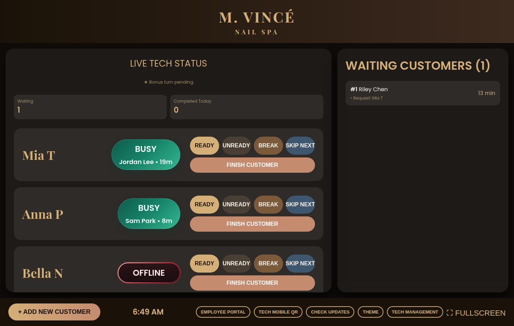
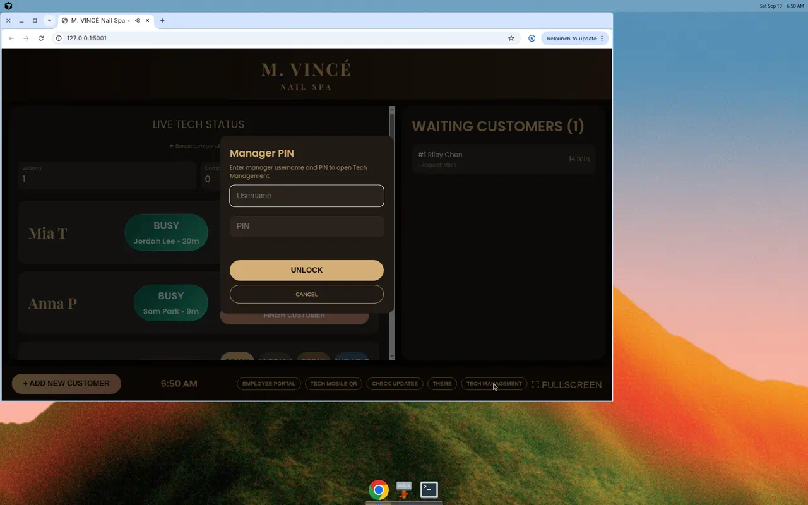
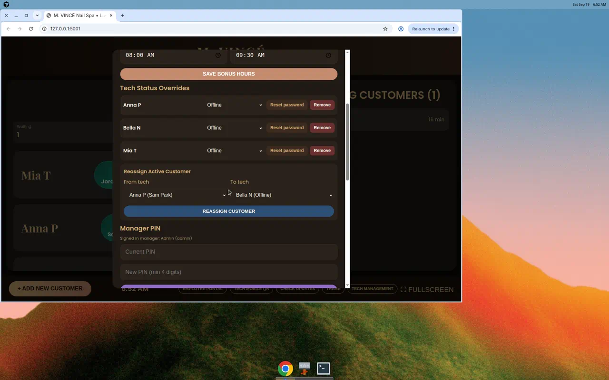
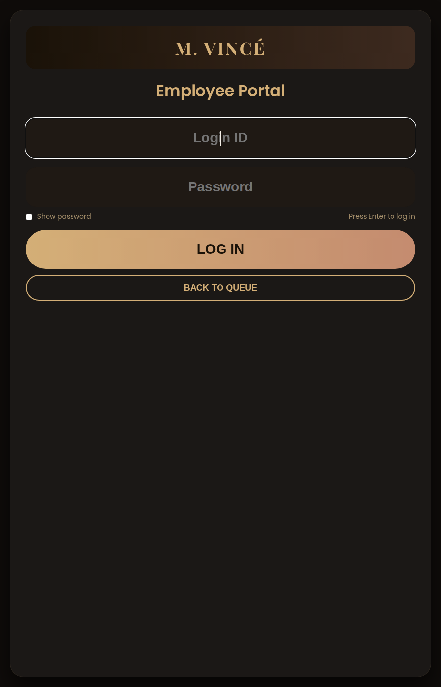

# NailQue

NailQue is the front-desk operating system for a nail spa. It keeps the live tech board, waiting queue, employee earnings, and phone check-in in sync on the salon LAN.

The desk computer runs the queue. Nail techs clock in from a phone on the same Wi-Fi. Managers unlock Tech Management with a username and PIN.

On first launch, NailQue opens a setup wizard. There is no default salon admin until you create one.

## Screenshots










## Demo video

<video src="docs/videos/queue-walkthrough.mp4" controls muted playsinline></video>

The recording walks through the live board, adding a guest to the waitlist, opening the employee portal, and showing the tech-mobile QR code.

## What it does

- **Live queue board** — tech status, waiting guests, requested techs, and automatic assignment. The **server** owns this state; the desk and phones send actions instead of overwriting each other
- **Appointment book** — book a guest for later, then mark them arrived
- **Receipts** — every finished ticket stores a printable receipt
- **End of day** — archive the waitlist, clock techs out, keep tomorrow's appointments
- **Editable menu and commission** — salon name, services, and tech split live in Tech Management
- **First-run wizard** — create the manager account; a `1234` PIN must be changed before Tech Management opens
- **Tech Management** — PIN gate, idle lock, Busy/Available/Break overrides, tech accounts, bonus hours, OTA, activity log
- **Employee portal** — weekly customers and estimated commission earnings
- **Tech mobile** — clock in, break, finish a ticket with services and custom add-ons, from a phone on the salon Wi-Fi
- **LAN QR code** — techs scan a code on the desk to open `/mobile`

## Quick start

Requires Python 3.9+.

```bash
cd luxe-nails
python3 -m pip install -r requirements.txt
cp .env.example .env
python3 app.py
```

Then open:

| Screen | URL |
| --- | --- |
| First-run setup | http://localhost:5001/setup |
| Queue board | http://localhost:5001/ |
| Employee portal | http://localhost:5001/employee |
| Tech mobile | http://localhost:5001/mobile |
| Health | http://localhost:5001/api/health |

The first manager is created in the setup wizard. If you use PIN `1234`, NailQue will ask you to change it before Tech Management unlocks.

Create nail-tech logins in **Tech Management** using `FirstName LastName` (example: `Mia Tran` → login ID `miat`). New techs must set their own password on first sign-in.

macOS source helper:

```bash
chmod +x start-mac.command
./start-mac.command
```

## Project layout

```text
luxe-nails/
  app.py                 thin launcher
  nailque/               Flask app package
    factory.py           app factory, security headers, logging
    queue.py             shared queue state, auto-assign, mutations
    salon.py             menu, commission, branding
    managers.py          hashed manager PINs and first-run setup
    sessions.py          bearer-token sessions
    security.py          hashing, LAN IP checks, rate limits
    updates.py           GitHub OTA updater
    routes/              HTTP endpoints by area
  static/css/            page styles
  static/js/             page scripts
  tests/                 pytest coverage for security and APIs
```

Runtime files stay out of git. In source mode they live next to `app.py`. Installed apps use:

- macOS: `~/Library/Application Support/NailQue`
- Windows: `%APPDATA%\NailQue`
- Linux: `~/.config/NailQue`

## Security

NailQue is a local salon app, not a public website. These controls are still enforced:

- Manager PINs and tech passwords are stored with PBKDF2 hashes, never plaintext
- The waiting queue is mutated through `/api/queue/action`; a stale desk `localStorage` dump cannot overwrite phone check-ins
- Shared queue APIs never return passwords
- Tech Management, updates, activity logs, and tech login changes require a manager session token
- Tech Management locks after the configured idle minutes
- Employee and mobile logins are server-side and rate-limited
- Mobile access is limited to private/loopback addresses
- `X-Forwarded-For` is ignored unless `TRUST_PROXY=true`
- Static hosting is limited to `/static` and `/assets` — Python and env files are not served
- OTA downloads must come from GitHub HTTPS hosts, and installers must live in the updates folder
- Optional LAN HTTPS via `SSL_CERTFILE` / `SSL_KEYFILE`

Do not commit `.env`, `manager_settings.json`, `salon_settings.json`, or `shared_state.json`.

## Tests

```bash
cd luxe-nails
python3 -m pip install -r requirements.txt -r requirements-dev.txt
python3 -m pytest -q
python3 qa_sweep.py
```

## Packaging

macOS:

```bash
cd luxe-nails
./build-mac.sh
```

Windows (on a Windows machine with Python 3.10+ and Inno Setup 6):

```powershell
.\build-windows.ps1
```

Installer details: [luxe-nails/INSTALLERS.md](luxe-nails/INSTALLERS.md)

Signing and notarizing: [luxe-nails/docs/SIGNING.md](luxe-nails/docs/SIGNING.md)

OTA: push a `v*` tag (not every commit to `main`). GitHub Actions builds the macOS pkg and publishes a Release. Installing an update still requires a signed-in manager. Pull requests run pytest and `qa_sweep.py`.

## Configuration

See [luxe-nails/.env.example](luxe-nails/.env.example). Useful flags:

| Variable | Purpose |
| --- | --- |
| `PORT` / `HOST` | Bind address (`0.0.0.0` is required for phones on LAN) |
| `TRUST_PROXY` | Only if a reverse proxy is in front of NailQue |
| `SSL_CERTFILE` / `SSL_KEYFILE` | PEM paths that turn on LAN HTTPS |
| `AUTO_UPDATE_REPO` | `owner/repo` for GitHub Releases |
| `AUTO_OPEN_BROWSER` | Open the queue on launch |
| `DEV_RELOAD` | Flask reloader for source development |

## License

Private salon software. All rights reserved unless the repository owner says otherwise.
